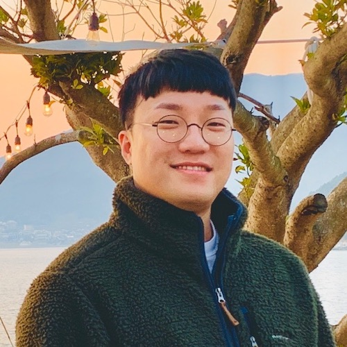

## About Me

Hi, I am Kyuchae Lee, CEO of Design Nerd in Korea. 
I'm always keen to be at the forefront of design trends.
I aim for a long and happy honeymoon while designing that I love.

---

## Research Interest

Lorem ipsum dolor sit amet, consectetur adipiscing elit. Aliquam finibus ipsum ac erat aliquam dapibus. Vestibulum vehicula placerat ex, a consectetur odio pharetra quis. Mauris id urna ante. Fusce pharetra diam ac nisi aliquet, vel egestas ex iaculis. Pellentesque laoreet cursus tellus sed pellentesque. Praesent a rhoncus elit. Nunc ipsum nisl, consequat sit amet pretium quis, gravida id ipsum.

---

## Publications

1. F.Bar, J.Doe: Effects of having a placeholder of a name
2. S.Holmes, J.Watson: Consequences of living with a sociopath in London

---

## Portfolio

This is a [link](http://google.com). Something *italics* and something **bold**.

Here is a table

Year | Client | Description
-----|--------|-------------
2017 | KBS | KBS Music Bank, general manager of graphic design for overseas performances in Jakarta, Singapore

Here is a horizontal rule

---

Here is a blockquote

> To a great mind, nothing is little

## References

* Foo Bar: Head of Department, Placeholder Names, Lorem
* John Doe: Associate Professor, Department of Computer Science, Ipsum
